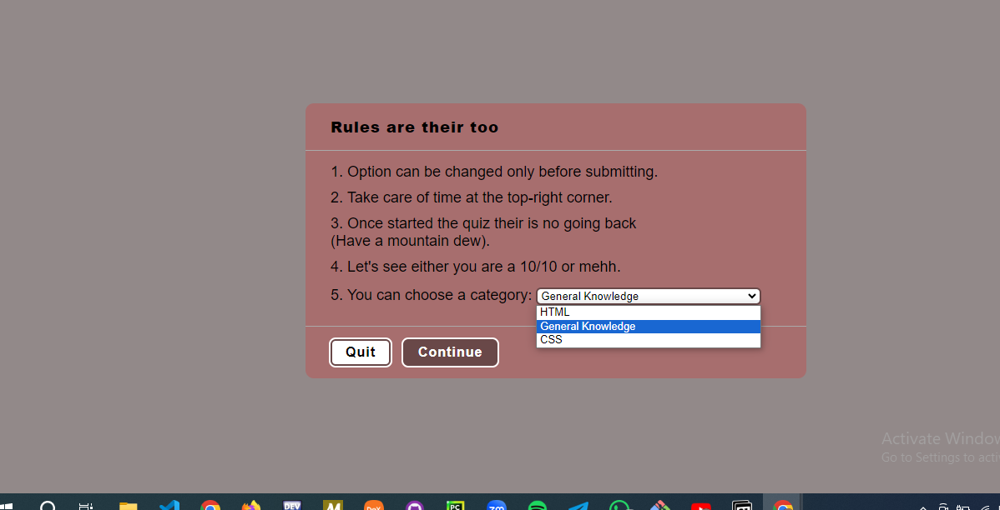

# Quiz App 
A single-page application built in HTML, CSS and JavaScript.

Allows users to test their knowledge about HTML, CSS, JS.

Contains different quiz JSON data files to display questions with multiple choice answers.

## Overview

## Demo
> This shows a brief overview of the quiz app.

# Technologies used
- HTML
- CSS
- JS
- GIT

# Tools used
- GITHUB
- VS CODE

# Extension used
- Live server

## Getting Started
To run this project locally in VS Code:
- Clone or download this repository.
- Open the folder in VS Code.
- Install Live Server extension.
- Right click the index.html file and select "Open with Live Server"
- Select a category and start the quiz!
